# GroupPad — Site Map, Pages, Modals, Flows & Models

> **Use this for the redesign phase.** It documents every page, every modal,
> every data model, the API, the roles, the flows, and the search/cost systems
> as they exist today — with **screenshots** in [`docs/screenshots/`](docs/screenshots/).
>
> **What GroupPad is:** a product for planning a group trip together. You sign in,
> **create a trip**, invite your group by link, and run a shared board to
> **collect rentals → like → shortlist → compare with AI → vote → lock the winner.**
>
> **Live:** https://exquisite-inspiration-production-7511.up.railway.app
> **Stack:** React 18 + TypeScript + Vite + Tailwind + Radix (`client/`); Express
> (`server.js`) on Railway; Apify/Gemini scraping in `pipeline.js`. The client uses
> **HashRouter** (`/#/t/:tripId/board`) — the server has no SPA fallback.

---

## 1. Architecture at a glance

```
client/  (Vite React+TS → client/dist, served by Express)
  src/
    store/AppContext.tsx   ← the ONE store: global account + active-trip state + all actions
    routing/TripGate.tsx   ← loads a trip from the URL; handles join-by-link (?join=code)
    lib/{api,utils,cn}.ts   ← typed API client · formatters (fmt, fmtMins, mdToHtml) · classnames
    views/                  ← one file per page (Landing, Trips, CreateTrip, Board, Manage, Help, Admin)
    components/
      chrome/   Navbar · Footer · BoardHeader
      board/    FilterBar · SubmitBar · SearchPanel · Itinerary · Decision · Shortlist ·
                Submitted · Caveats · Pipeline · CompareDock
      modals/   AuthModal · OnboardingModal · DetailModal · ComparisonModal
      ui/       Button · Dialog · Checkbox · Slider · Badge · ToastStack (shadcn-style on Radix)
      Card.tsx · Carousel.tsx · Markdown.tsx
server.js    ← all /api routes · per-trip JSON storage · auth · AI compare · search spawning · Apify guard
pipeline.js  ← Apify scrapers: LA full pipeline (SQLite, every 3 days) + per-trip search (TRIP_ID mode)
data/        ← trips.json (registry) · trips/<id>/*.json (per-trip) · users/sessions/usage (global) · pipeline.db
```

**Persistence:** flat JSON, atomic writes, no cache. Trip-scoped stores live in
`data/trips/<tripId>/`. The **LA trip** is special: id `la-birthday-2026`, reads
the legacy flat files in `data/` (migrated in place). Global stores: `users`,
`sessions`, `magic`, `usage`, `trips`. The LA pipeline uses **SQLite**.

---

## 2. Roles

| Role | How | Can do |
|------|-----|--------|
| **Visitor** (signed-out) | open any trip link | **view** the board (listings, prices, distances) — no writes |
| **Member** | sign in + open invite link (auto-joins on first write) | vote 👍/👎, ⭐ top-choice, add listings, post caveats, run AI compare |
| **Organizer** | created the trip (`owner_id === you`) | member powers **+** post itinerary, delete listings/caveats, lock the ✅ official pick, run/re-run search, invite link + group pulse, **delete trip** |
| **Platform super-admin** | holds `x-admin-key` (`ADMIN_KEY` env) | the usage meter (`/#/admin`); cross-trip logout. **Site manager = gold.nwobu@gmail.com** (`OWNER_EMAIL`) gets the Apify-limit alert emails. |

**Access model:** invite-link, **view-by-link**. Trip ids carry random entropy
(unguessable = the view secret); the owner-only `join_code` gates *joining*.

---

## 3. Pages

### 3.1 Landing — `/#/` signed-out · 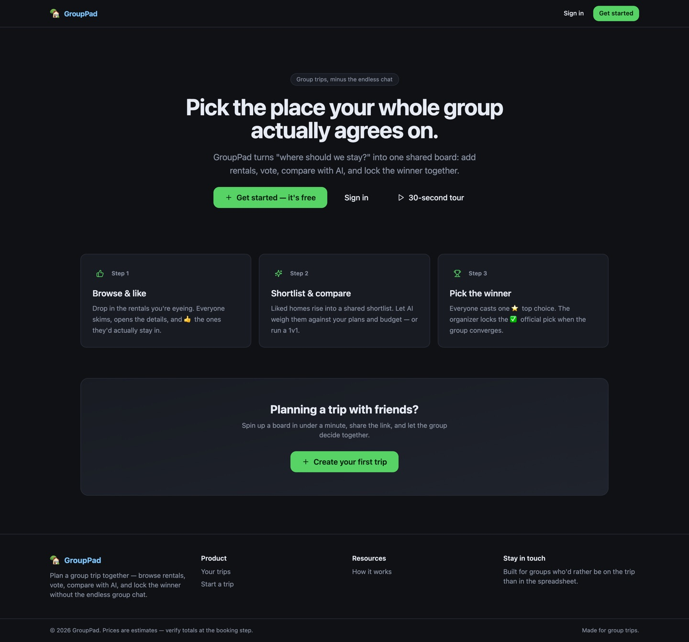
The product front door (signed-in users are redirected to `/#/trips`).
- Hero, pill badge, CTAs: **Get started** (Google sign-in / create-trip), **Sign in**, **30-second tour**.
- 3 "how it works" step cards + a CTA band.

### 3.2 Trips dashboard — `/#/trips` (sign-in required) · 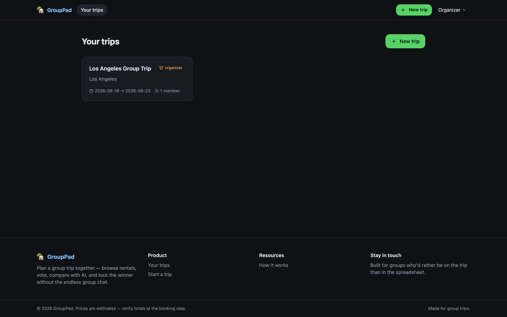
- "Your trips" + **New trip**. Each card: name, destination, dates, member count, **organizer** crown badge. Click → that board. Empty state prompts "Create your first trip".

### 3.3 Create trip — `/#/trips/new` · 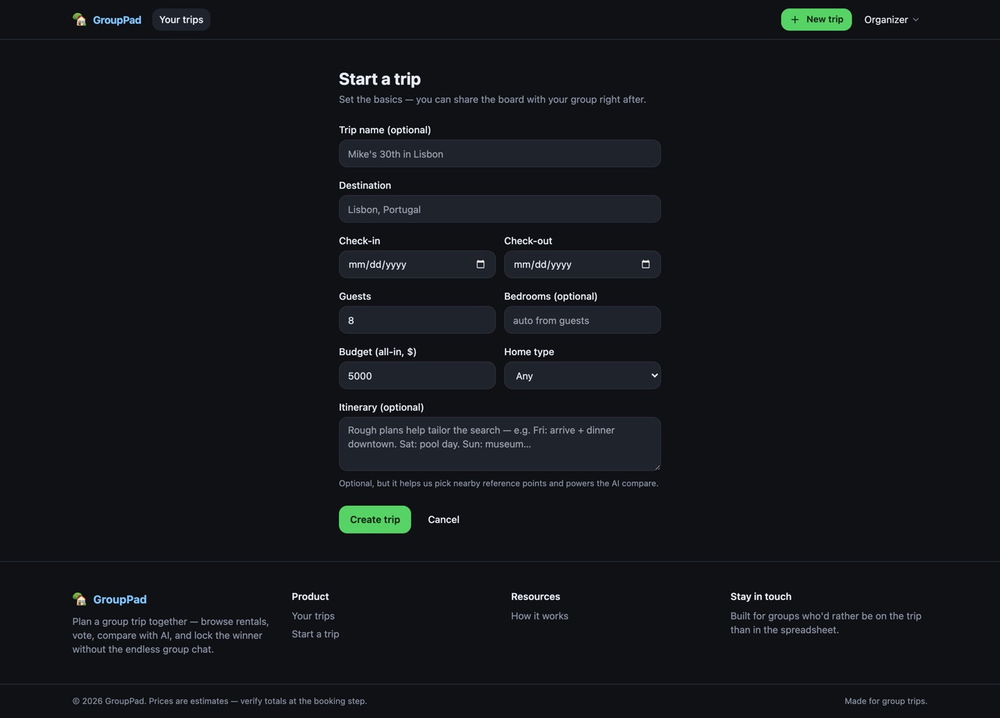
Form → `POST /api/trips`, then redirect to the new board (auto-fires a capped search):
- Trip name (optional) · **Destination** · Check-in / Check-out · Guests · **Bedrooms** (optional, drives search min/max) · **Budget** · **Home type** · **Itinerary** (optional textarea — saved before the search, feeds reference points + AI).

### 3.4 Board — `/#/t/:tripId/board` (the core app)
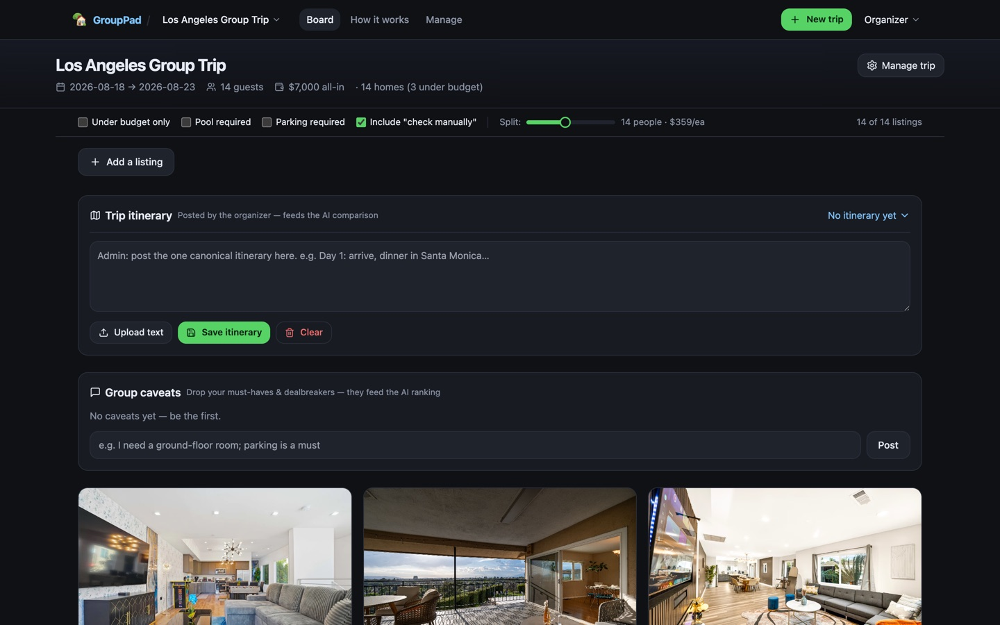 · **full page:** [`07-board-full.jpg`](docs/screenshots/07-board-full.jpg)
Loaded via `TripGate` (loading / 404 / `?join=code` auto-join). Top → bottom:
1. **BoardHeader** — trip name, dates, guests, budget, "N homes (M under budget)", **Manage trip** (organizer).
2. **Join banner** (visitor/non-member) — "viewing as a guest · Sign in to join".
3. **FilterBar** (sticky) — Under-budget / Pool / Parking / Include "check manually" + **split slider** (per-person cost) + count.
4. **SubmitBar** — "Add a listing": paste any Airbnb/VRBO/Booking URL (+ optional price), "open with trip dates" helper.
5. **SearchPanel** (organizer) — "Finding rentals in <dest>…" while searching; empty-state "Search <dest> rentals"; "Find more rentals" once populated.
6. **Itinerary** — collapsible; organizer editor (textarea, upload .txt/.md, save, clear). Feeds AI compare.
7. **Decision** — pinned ✅ official-pick banner **or** the ⭐ top-choice leaderboard (bars); organizer "Make official"/Unlock.
8. **Shortlist** (net-likes ≥ 1) — **Compare with AI** panel (criteria, whole-shortlist analyze, 1v1 / compare-selected) + group insights (staleness banner) + the shortlisted cards.
9. **Community Submissions** — member-added homes not yet liked.
10. **Group caveats** — must-haves/dealbreakers chat (feeds AI ranking).
11. **Main grid** — the curated/searched homes (filtered).
12. **Live Listings** (LA only) — auto-scraped, "refreshed every 3 days".
Floating: **CompareDock** (when cards ticked) + **ComparisonModal**.

### 3.5 Manage — `/#/t/:tripId/manage` organizer only · 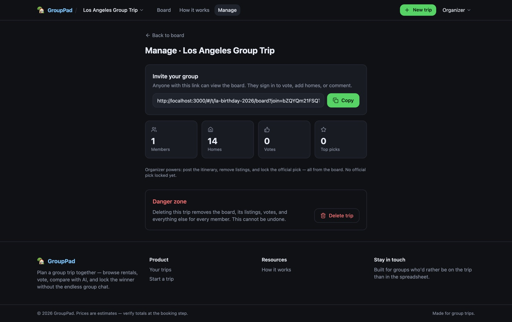
Invite link (+ copy), group pulse stats (members/homes/votes/top-picks), **Danger zone → Delete trip**.

### 3.6 Help — `/#/t/:tripId/help` · 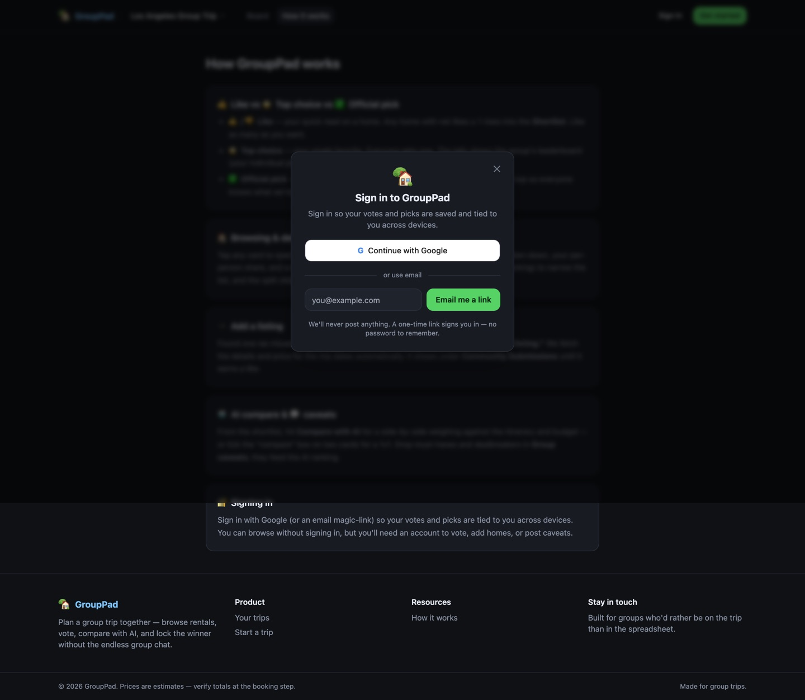
5 static explainer cards (like vs top-choice vs official pick, browsing, adding, AI/caveats, signing in).

### 3.7 Platform admin — `/#/admin` super-admin · 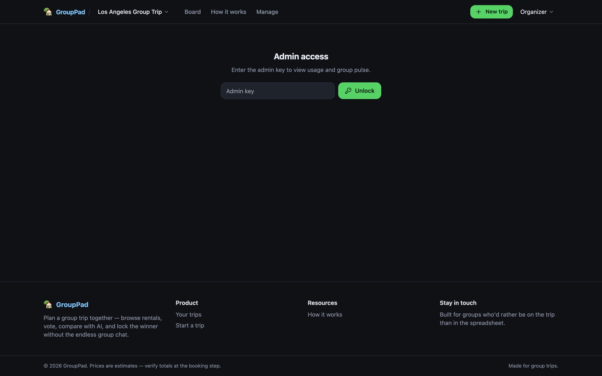
API usage meter (Gemini tokens/est cost, Firecrawl credits, Apify spend vs limit + recent runs, group pulse). Shows a key-entry prompt until `admin_key` is set.

---

## 4. Modals & overlays (mounted globally in `App.tsx`)

### 4.1 AuthModal · 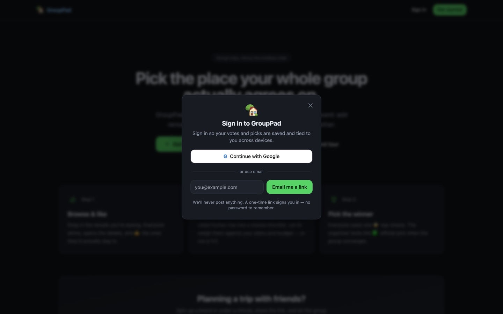
Opens from any gated action or the "Sign in"/"or use email" buttons. **Continue with
Google** (full-page OAuth) + **email magic-link** (inline-validated, one-time link,
no password). `requireSignIn(action)` opens it with a contextual reason.

### 4.2 OnboardingModal · 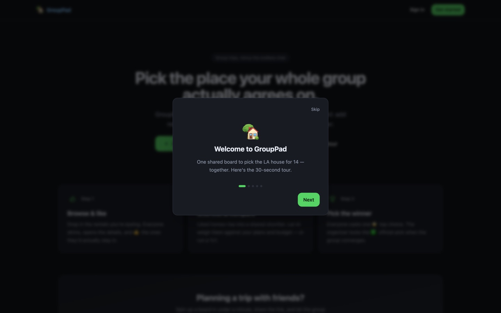
5-slide tour (Welcome → Browse & like → Shortlist & compare → Pick the winner →
Add & sign in) with dots + Back/Next/Skip. Auto-shows once (`localStorage.gp_onboarded`);
replayable via "30-second tour".

### 4.3 DetailModal · 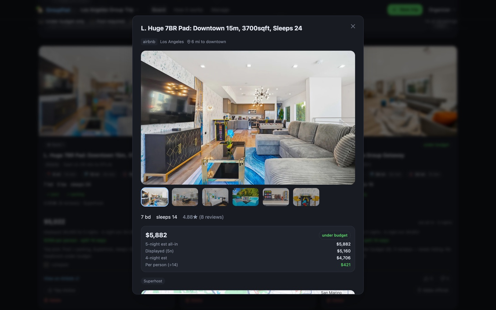
Opens on any card tap. Photo gallery + thumbnails, specs, **the 3 distance+time rows**
(downtown / airport / attraction with full place names), price breakdown, per-person
split, amenities, an **embedded map**, and the vote / ⭐ top-choice / 📌 official actions.

### 4.4 ComparisonModal · 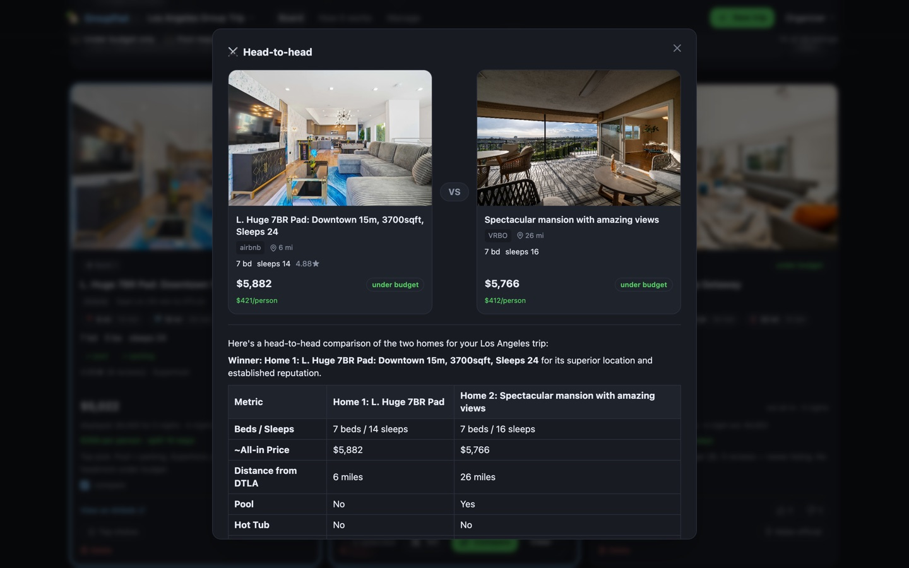
Triggered by the CompareDock or the shortlist panel. **1v1** shows the two picked homes
as columns with a **VS** divider; multi shows a column grid. The Gemini verdict (winner,
table, "pick X if…") renders below. Dismiss clears the selection.

### 4.5 ToastStack
Bottom-right non-blocking toasts (✅/⚠️/ℹ️) for actions, errors, sign-out — auto-dismiss, click to close. Replaced all native `alert()`s.

### 4.6 CompareDock
Floating bottom-center pill on the board when ≥1 card is ticked "compare": count, ⚔️ 1v1 (exactly 2), 🤖 Compare (≥2), Clear.

---

## 5. The Card component (reused in 4 grids)
`Card.tsx`: photo carousel · rank/community/live + budget badges · name · source + area ·
**distance+time pills** (`📍 9mi·19m  ✈️ 5mi·7m  🎡 19mi·38m`; falls back to "X mi to
downtown") · specs (bd/ba/sleeps) · amenity chips · reviews · price "est all-in" +
per-person split · note · compare checkbox · "View on <source>" · 👍/👎 vote bar ·
⭐ top-choice · organizer "Make official" + Delete.

---

## 6. Detailed flows

**A. Visitor (no account) opens a shared link**
`/#/t/:id/board?join=code` → TripGate loads the trip → board renders read-only with a
"viewing as a guest" banner → any vote/add/comment opens the **AuthModal** → after
sign-in they're auto-joined and the action proceeds.

**B. Member participates**
Sign in → board → 👍 homes (liked homes rise into **Shortlist** at net-likes ≥ 1) →
optionally **Add a listing** (URL → scraped + priced → Community Submissions) → post
**caveats** → **Compare with AI** (whole shortlist → group insights; or tick 2 → 1v1 VS)
→ cast one ⭐ **top choice** (private; only totals show in the Decision leaderboard).

**C. Organizer runs the trip**
Create trip (form, optional itinerary) → board auto-searches the destination (capped) →
**SearchPanel** shows "Finding rentals…" then fills in → post the **itinerary** → invite
the group via **Manage → copy link** → as votes land, watch the **Decision** leaderboard
→ **Make official** to pin the ✅ winner → (optionally) **Delete trip** when done.

**D. Search lifecycle (per trip)**
`POST /api/trips` → `spawnTripSearch` (if Apify under limit) → `pipeline.js` TRIP_ID mode:
Airbnb search for the destination (min/max bedrooms from the form) **+** Gemini geocodes
3 reference points (downtown/airport/attraction, itinerary-aware) → ranks under-budget +
cheapest first, caps to ~10, computes distance+time per home → writes `trips/<id>/listings.json`.
A `.searching` marker + `GET /search-status` drive the board's progress UI; the client
auto-refreshes listings when it finishes.

**E. LA "Live Listings" refresh (recurring)**
Every 3 days `runPipelineJob` (after an Apify-spend check) runs the full `pipeline.js`:
VRBO + Airbnb → SQLite, computing the 3 distances during discovery. Served via
`GET /pipeline-listings`.

**F. Cost protection**
Before any scrape, `apifyGuard` checks Apify spend; at ≥85% of the monthly limit it
**pauses the run** and emails the **site manager** (`OWNER_EMAIL`, throttled 12h) to
rotate `APIFY_TOKEN`.

---

## 7. Data models

**Trip** (`data/trips.json`): `id, name, destination, checkin, checkout_5n, checkout_4n,
adults, budget, bedrooms?, home_type?, tax_rate, cleaning_placeholder, owner_id, members[],
join_code, created_at, refreshed_at, ref_points?`
`ref_points = { downtown|airport|attraction: { name, lat, lng } }`.
API returns a **TripView** (strips `members/owner_id/join_code` for non-owners; adds
`isOwner, isMember, memberCount`).

**Listing**: `id, source, url, name, area, distance_mi,
distances:[{icon,kind,label,mi,min}], bd, ba, sleeps, pool, parking, hot_tub, rating,
reviews, superhost?, budget('under'|'marginal'|'over'|'unknown'), check_manual,
displayed_5n, est_5n, est_4n, photos[], amenities[], note?, rank?(curated),
submitted_by?/submitted_at?(submissions), last_seen?/enriched?(pipeline)`.

**Votes** `{ [listingId]: { [userId]: 'up'|'down' } }` · **FinalState**
`{ counts, total, myPick, decision:{listing_id,locked_at}|null }` · **Caveat**
`{ id, user_id, name, text, created_at }` · **Itinerary** `{ text, updated_at }` ·
**Insights** `{ analysis, ids[], created_at }` · **User** `{ id, email, name }`.

---

## 8. API surface (`/api`)

- **Auth (global):** `GET /auth/me`, `POST /auth/request-link`, `GET /auth/verify`, `PATCH /auth/me`, `POST /auth/logout`, `GET /auth/google(+/callback)`.
- **Trips (global):** `GET /me/trips`, `POST /trips`, `GET /trips/:id`, `POST /trips/:id/join`, `POST /trips/:id/leave`, `DELETE /trips/:id` (owner), `GET /trips/:id/pulse` (owner), `POST /trips/:id/run-search` (owner), `GET /trips/:id/search-status`.
- **Trip-scoped** (`/trips/:id/…`; read = open, write = auth + auto-join, owner-only noted): `listings`, `DELETE listings/:lid` (owner), `votes` GET/POST, `submitted`, `submit` POST, `DELETE submitted/:lid` (owner), `pipeline-listings`, `itinerary` GET / POST-owner, `caveats` GET/POST / DELETE-owner, `insights`, `compare-listings` POST, `final`, `final-vote` POST, `decision` POST-owner. Legacy flat aliases (`/api/listings`, …) → the LA trip.
- **Platform admin (x-admin-key):** `GET /admin/verify`, `GET /admin/usage`, `POST /admin/run-pipeline`, `POST /admin/logout-all`.

---

## 9. State / env

- **localStorage:** `admin_key` (super-admin), `gp_onboarded` (tour seen). **Cookie:** `gp_session` (HttpOnly, 30-day).
- **Env (Railway):** `APIFY_TOKEN`, `GEMINI_API_KEY`, `RESEND_API_KEY`, `MAIL_FROM`, `GOOGLE_CLIENT_ID/SECRET/REDIRECT_URI`, `ADMIN_KEY`, `OWNER_EMAIL` (site manager / LA owner), `AIRBNB_LOCATIONS`, `TRIP_SEARCH_MAX`, `PIPELINE_INTERVAL_DAYS`, `APIFY_ALERT_PCT`.

---

## 10. Redesign priorities (carry into the next phase)

1. **Board density** — 12 stacked sections; the biggest win is clearer hierarchy / progressive disclosure (collapse advanced sections, tabs, or a sidebar).
2. **Emoji as structural icons** (📍✈️🎡, badges) — swap chrome icons to an SVG set; keep emoji only where intentionally playful (the ui-ux-pro-max skill flags this).
3. **Landing + Trips dashboard** are functional but plain — prime for a real brand, type scale, and color system.
4. **Formalize the component system** — distance pills, budget/rank badges, cards, the VS layout → design tokens + a documented kit.
5. **Mobile** — verify the sticky filter bar + dense cards on small screens.
6. **Empty / loading / searching states** exist but are minimal — strong redesign surface.

> Screenshots regenerate via `node scripts/screenshots.cjs` (local server + a forged session).
